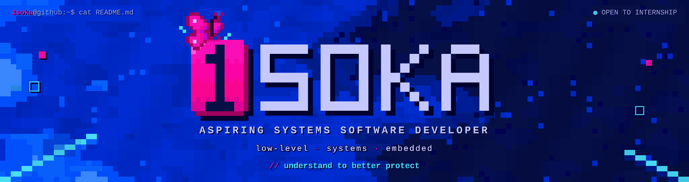

<!-- ============ GIF (right) ============ -->

  

<h3 align="center">── Tech Stack 👀 ──</h3>

<h1></h1>

<!-- ============ GITHUB TROPHIES ============ -->
<h3 align="center">── GitHub Trophies 🏆 ──</h3>

  

